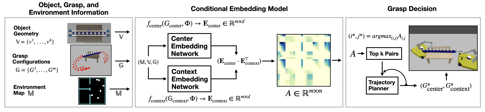
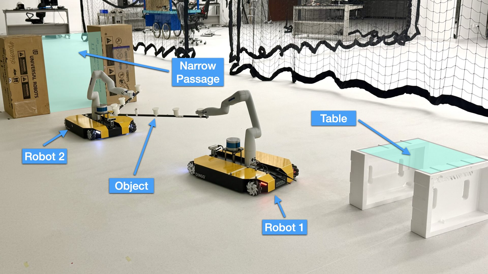
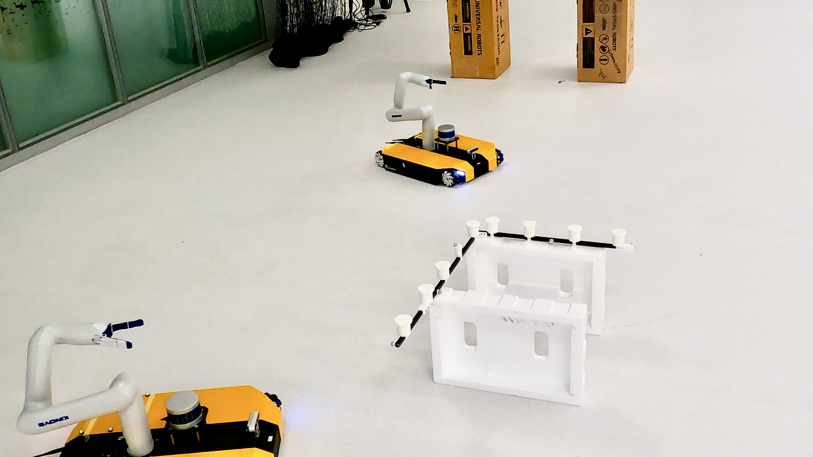
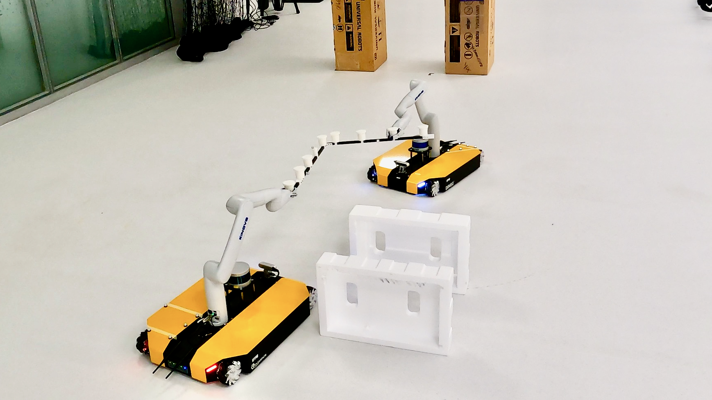
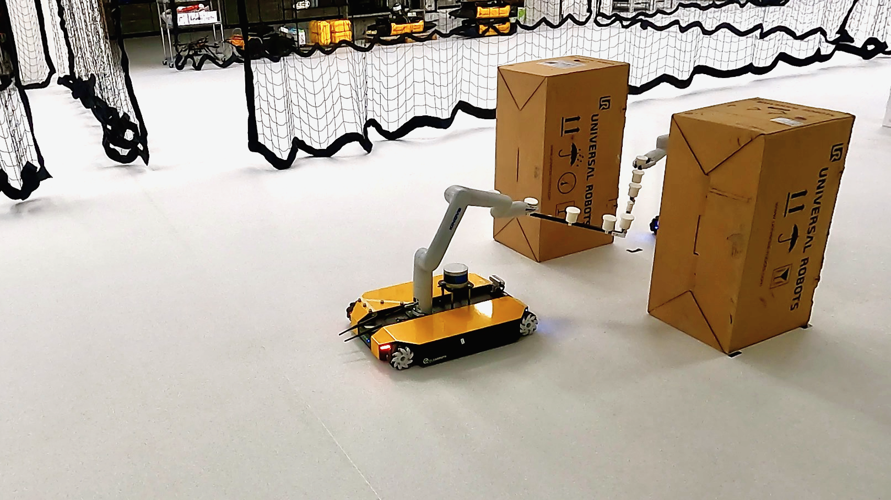
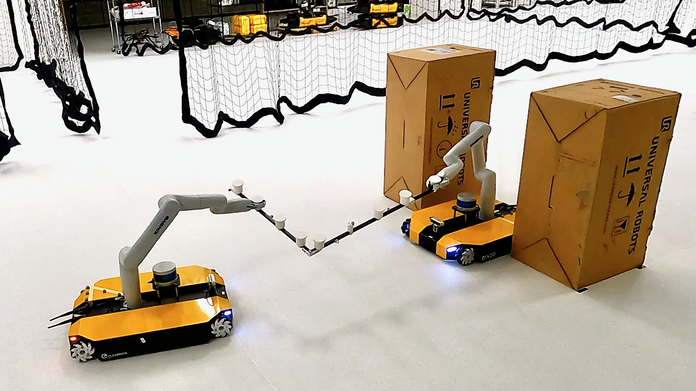
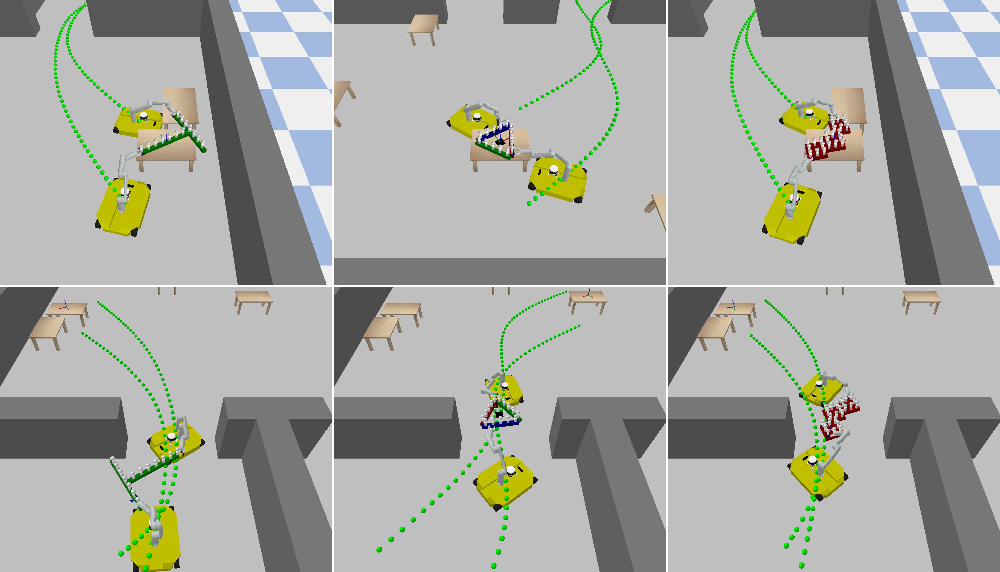

<div align="center">

# Cooperative Grasping for Collective Object Transport in Constrained Environments

[](https://doi.org/10.1109/LRA.2026.3653338)
[](https://doi.org/10.1109/LRA.2026.3653338)
[](https://arxiv.org/abs/2509.03638)
[](https://opensource.org/licenses/Apache-2.0)
[](https://www.python.org/downloads/)

<br/>


**Presented at ICRA 2026, Vienna, Austria**

<br/>

**David Alvear · George Turkiyyah · Shinkyu Park**

*Computer, Electrical and Mathematical Sciences and Engineering*
*King Abdullah University of Science and Technology (KAUST), Thuwal, Saudi Arabia*

`{david.alvear, george.turkiyyah, shinkyu.park}@kaust.edu.sa`

</div>

---

## Abstract

We propose a novel framework for decision-making in cooperative grasping for two-robot object transport in constrained environments. The core of the framework is a *Conditional Embedding (CE)* model consisting of two neural networks that map grasp configuration information into an embedding space. The resulting embedding vectors are then used to identify feasible grasp configurations that allow two robots to collaboratively transport an object. To ensure generalizability across diverse environments and object geometries, the neural networks are trained on a dataset comprising a range of environment maps and object shapes. We employ a supervised learning approach with negative sampling to ensure that the learned embeddings effectively distinguish between feasible and infeasible grasp configurations. Evaluation results across a wide range of environments and objects in simulations demonstrate the model's ability to reliably identify feasible grasp configurations. We further validate the framework through experiments on a physical robotic platform, confirming its practical applicability.

---

## Method Overview

<div align="center">
  
  <br/>
  <em>The Conditional Embedding (CE) model maps grasp configuration information into an embedding space to identify feasible collaborative grasps in constrained environments.</em>
</div>

---

## Experimental Platform

<div align="center">
  
  <br/>
  <em>Two mobile manipulators tasked with cooperatively grasping and transporting an object through a constrained corridor.</em>
</div>

---

## Video

<div align="center">

[](https://www.youtube.com/watch?v=0DUeQ5Ukf1k)

*Click to watch the paper video on YouTube.*

</div>

---

## Physical Experiments

Experiment sequence showing the two mobile manipulators executing the full cooperative transport task — from pre-grasp positioning through corridor traversal.

<div align="center">
<table>
  <tr>
    <td align="center"><br/><sub><b>Pre-grasp</b></sub></td>
    <td align="center"><br/><sub><b>Grasp</b></sub></td>
    <td align="center"><br/><sub><b>Corridor</b></sub></td>
    <td align="center"><br/><sub><b>Transport End</b></sub></td>
  </tr>
</table>
</div>

---

## Simulation Results

<div align="center">
  
  <br/>
  <em>Object trajectories across a diverse set of simulation environments and object geometries, demonstrating the generalization of the learned CE model.</em>
</div>

---

## Generalized CE package

The paper's `CenterEmbeddingResNetv4`-era code is being generalized into a
reusable, config-driven package under
`conditional_embedding_model/src/conditional_embedding_model/general/`:
pluggable encoders, pluggable affinity scorers, and a generic training loop,
while every legacy checkpoint stays loadable without file conversion. See
[`general/README.md`](conditional_embedding_model/src/conditional_embedding_model/general/README.md)
for the architecture, config reference, legacy-checkpoint how-to, and known
quirks. A fully synthetic, CPU-only smoke test/example is runnable directly:

```bash
python -m conditional_embedding_model.general.examples.toy
```

---

## Citation

If you use this work, please cite:

```bibtex
@ARTICLE{11345991,
  author={Alvear, David and Turkiyyah, George and Park, Shinkyu},
  journal={IEEE Robotics and Automation Letters},
  title={Cooperative Grasping for Collective Object Transport in Constrained Environments},
  year={2026},
  volume={11},
  number={3},
  pages={2967-2974},
  doi={10.1109/LRA.2026.3653338}
}
```

---

## License

This project is licensed under the Apache License 2.0 — see the [LICENSE](LICENSE) file for details.

---

<!--
## Repository Structure

```
.
├── ...
```

## Installation

### Prerequisites

### Setup

```bash
# Clone the repository
git clone https://github.com/...
cd CooperativeGrasping
```
-->
